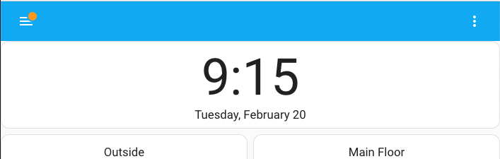

# two-line-clock-card
A two-line clock card showing time and date, for use with Home Assistant on a panel.

Derived from [https://github.com/fufar/simple-clock-card](https://github.com/fufar/simple-clock-card)

Amazingly, Home Assistant does not have a built-in clock card. There
are a couple in HACS but none of them displayed what I was looking
for, which is influenced by the iPhone lock screen.

  

Note: I'm in the US. I've tried to use the JavaScript locale-aware
time conversion functions, so hopefully this behaves reasonably in
other geographies, but let me know if not.

# Installation:

1. Copy two-line-clock-card.js into the `config/www` directory. 

2. Enable advanced mode by clicking on your user profile in the lower left.

3. Add the resource:

   - Go to Settings > Dashboards, then under the 3 dot menu in the
     upper right, select Resources.

   - Click the blue Add Resource button in the lower right.

   - Use the URL `/local/two-line-clock-card.js` (assuming you have
     put the JS file into your `www` directory).

   - Select "JavaScript module" as the resource type.

# Configure the card

Edit the yaml for a dashboard and add something like

```
    - type: 'custom:two-line-clock-card'
      time_font_size: 72px
      date_font_size: 1.2rem
      show_seconds: false
      show_am_pm: false
```

## Options

| option             | default | description                                                                  |
|--------------------|:-------:|------------------------------------------------------------------------------|
| time_font_size     | 1rem    | Size of the first line; units required (rem or px)                           |
| date_font_size     | 1rem    | Size of the second line; units required (rem or px)                          |
| show_am_pm         | false   | Controls display of AM/PM; values can be "true", "false", or "lower"         |
| show_seconds       | false   | When true, shows the seconds                                                 |

